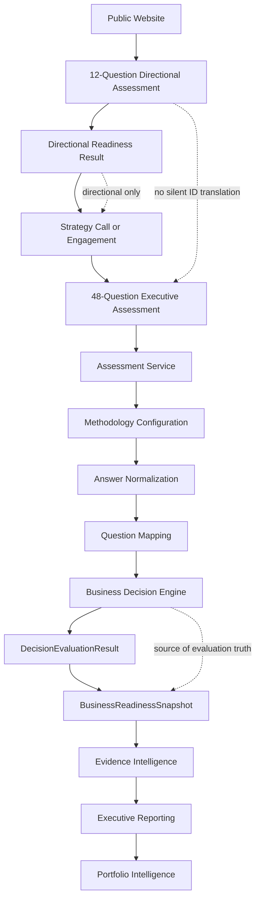

# Assessment Boundary Architecture v1

## Purpose

Nguyen AI maintains two assessment layers because the public website assessment
and the internal executive assessment methodology solve different business
problems.

The public layer is a low-friction directional intake instrument. It helps a
prospect understand broad readiness signals and start a planning conversation
without submitting sensitive evidence, files, repositories, credentials, or
business records.

The internal layer is the governed executive assessment framework. It uses the
canonical Business Decision Methodology, the deterministic Decision Engine, and
explanation metadata to transform validated business evidence into structured
executive intelligence.

These layers are intentionally separate assessment products. They must not be
treated as the same questionnaire, the same input contract, or the same output
contract. The boundary protects public website usability while preserving the
explainability, determinism, and governance required for executive-grade
decision support.

## Public Directional Assessment

The Public Directional Assessment is owned by the public website experience. It
is designed to be short, business-friendly, and safe for unaudited public use.

Responsibilities:

- Provide low-friction public intake.
- Capture broad directional signals.
- Support lead qualification and strategy-call routing.
- Act as a conversation starter for AI, security, automation, engineering,
  cloud, knowledge, and leadership visibility topics.
- Avoid evidence uploads, file review, repository review, credential handling,
  or sensitive business record collection.
- Present results as directional and preliminary.
- Make clear that the public result does not represent full methodology
  coverage.

The public assessment may identify themes such as:

- AI adoption interest.
- Security maturity signals.
- Automation potential.
- Engineering and delivery maturity.
- Cloud operating maturity.
- Knowledge management maturity.
- Executive visibility.
- Engagement urgency and buyer context.

The Public Directional Assessment must not produce:

- An authoritative Business Readiness Snapshot.
- Executive recommendations.
- Evidence-backed confidence conclusions.
- Final readiness decisions.
- Governed service decisions presented as certainty.
- Claims that it evaluates all canonical methodology dimensions.
- Claims that it reviewed business evidence beyond the submitted directional
  answers.

Public directional outputs should remain explicitly labeled as directional,
preliminary, and intended to support a planning conversation or engagement
intake.

## Internal Executive Assessment

The Internal Executive Assessment is owned by the Assessment Service and the
approved Business Decision Methodology. It is the governed framework for
executive-grade business readiness evaluation.

Responsibilities:

- Use the 48-question canonical methodology.
- Preserve the governed business vocabulary.
- Use documented evidence categories.
- Use documented readiness dimensions.
- Execute deterministic Decision Engine evaluation.
- Preserve explanation metadata for evaluated questions, dimensions, weights,
  normalized scores, evidence categories, and weight categories.
- Support future deterministic confidence methodology.
- Support future deterministic recommendation priority methodology.
- Support future Business Readiness Snapshot generation.
- Provide the foundation for future executive intelligence outputs.

The internal assessment framework is governed by:

- `docs/business-decision-methodology/01-decision-methodology.md`
- `docs/business-decision-methodology/02-question-catalog.md`
- `docs/business-decision-methodology/03-evidence-catalog.md`
- `docs/business-decision-methodology/04-readiness-methodology.md`
- `docs/business-decision-methodology/05-confidence-methodology.md`
- `docs/business-decision-methodology/06-recommendation-priority.md`
- `docs/business-decision-methodology/07-service-decision-framework.md`
- `docs/business-decision-methodology/08-business-decision-roadmap.md`
- `docs/architecture/assessment-decision-engine-v2.md`

The Internal Executive Assessment is the path that can produce executive-grade
decision support after the required methodology, rule, confidence,
recommendation, and output-contract increments are approved and implemented.

## Contract Boundary

The two assessment layers require separate, versioned contracts.

### Public Directional Assessment Contract

The public contract is defined by the website product experience.

Contract elements:

- Directional assessment version.
- Public question IDs.
- Public answer model.
- Directional output schema.
- Public result labels and disclaimers.
- Public submission flow and Cognito frontend behavior.

Current public characteristics:

- The website uses a 12-question catalog.
- Website question IDs are public product identifiers, not canonical
  methodology question IDs.
- Website answer values currently represent selected option indexes.
- Website results currently include local directional scoring for AI maturity,
  security maturity, automation potential, and suggested next step.

The public contract is appropriate for a public intake experience. It is not
the contract for deterministic executive assessment methodology execution.

### Internal Executive Assessment Contract

The internal contract is defined by the Assessment Service methodology and
Decision Engine.

Contract elements:

- Canonical methodology version.
- Canonical question IDs.
- Configured answer types.
- Configured answer ranges for normalization.
- Configured readiness dimensions.
- Configured evidence categories.
- Configured placeholder weights until final weights are approved.
- `DecisionEvaluationResult`.
- `BusinessReadinessSnapshot`.

Current internal characteristics:

- The canonical methodology version is `business-decision-methodology-v1`.
- The canonical question catalog contains 48 questions.
- The Decision Engine assumes a complete answer set that maps to the canonical
  methodology configuration.
- The Decision Engine rejects unknown question IDs.
- The Decision Engine rejects missing required canonical questions.
- The Decision Engine validates answer type and configured answer range before
  normalization.

Public question IDs must not be silently mapped into canonical methodology
questions unless an approved, versioned translation methodology is created.
Any translation layer would need its own documented version, source and target
question mappings, answer transformation rules, confidence impact, test
fixtures, and governance approval.

## Customer Journey

The intended customer journey separates public discovery from executive-grade
assessment:

```text
Public Website
  ->
12-Question Directional Assessment
  ->
Directional Readiness Result
  ->
Strategy Call or Engagement
  ->
48-Question Executive Assessment
  ->
Business Decision Engine
  ->
Business Readiness Snapshot
  ->
Evidence Intelligence
  ->
Executive Reporting
  ->
Portfolio Intelligence
```

The public assessment starts the conversation. The internal executive
assessment produces governed business decision support after scope, evidence,
and methodology requirements are satisfied.

## Repository Ownership

### `nguyen-ai-website`

The website repository owns the public assessment experience.

Responsibilities:

- Public assessment UI.
- Public question catalog.
- Public directional result presentation.
- Cognito frontend flow.
- API client.
- Public copy that clearly labels directional outputs and avoids unsupported
  claims.

The website must not duplicate authoritative executive scoring once the
Assessment Service exposes governed executive assessment outputs. Public local
scoring may exist only as directional product behavior and must be labeled
accordingly.

### `nguyen-ai-assessment-service`

The assessment-service repository owns the internal executive assessment
framework and deterministic business evaluation foundation.

Responsibilities:

- Internal executive assessment methodology.
- Deterministic Decision Engine.
- Configuration-driven answer normalization.
- Configuration-driven question mapping.
- Dimension and overall evaluation.
- Explanation metadata.
- Business Readiness Snapshot projection.
- Future confidence methodology.
- Future recommendation priority methodology.
- Future service decision methodology.

Downstream capabilities should consume Decision Engine outputs rather than
recomputing or replacing evaluation behavior.

## Governance Rules

- Public directional outputs must be clearly labeled directional.
- Public assessment versions and executive assessment methodology versions must
  remain distinct.
- Public question IDs and canonical methodology question IDs must remain
  distinct unless a governed migration or translation methodology is approved.
- No hidden ID translation is allowed.
- No frontend duplication of authoritative executive scoring is allowed once
  executive scoring is exposed by the Assessment Service.
- Methodology changes require governed documentation updates and tests.
- Question meaning must not change within the same methodology version.
- Numeric weights, thresholds, risk caps, confidence formulas, recommendation
  mappings, and service-routing rules require explicit methodology approval
  before production use.
- Downstream components must consume Decision Engine outputs rather than
  recomputing evaluation.
- Executive recommendations must not be generated from public directional
  answers unless a governed translation and confidence methodology exists.
- AI, LLM, or Bedrock reasoning must not become the source of scoring,
  readiness interpretation, confidence, recommendation priority, or service
  decisions.

## Current State and Intentional Limitations

Current state:

- The website currently submits its 12-question payload to a placeholder API
  path.
- The production Lambda handler currently validates the request and returns the
  deterministic placeholder response.
- The production Decision Engine is not yet the authoritative handler path.
- The website currently contains local directional scoring.
- The Business Readiness Snapshot exists internally as a projection of
  `DecisionEvaluationResult`.
- The Business Readiness Snapshot is not exposed through the API.

Intentional limitations:

- Confidence methodology is not implemented.
- Recommendation priority is not implemented.
- Executive recommendations are not implemented.
- Governed service decisions are not implemented.
- Evidence ingestion is not implemented in the Assessment Service.
- Persistence is not implemented in the Assessment Service.
- Contract integration between the public and executive assessment layers
  remains future work.

These limitations are intentional and consistent with the frozen Decision
Engine v2 baseline. Future work should add capabilities through versioned,
governed increments rather than by redefining the current Decision Engine
architecture.

## Architecture Diagram



The dotted edges identify governance boundaries. The public assessment may
inform a strategy call or engagement, but it must not silently become the
canonical executive assessment. The Decision Engine remains the source of
deterministic evaluation truth for executive assessment consumers.

## Review Notes

This boundary baseline preserves the frozen Decision Engine v2 architecture.
It does not change production code, tests, API behavior, methodology
configuration, question IDs, answer normalization, confidence methodology,
recommendation methodology, or service routing.

The document formalizes the approved product boundary:

- The 12-question public assessment is a lightweight directional intake
  instrument.
- The 48-question canonical methodology is the governed internal executive
  assessment framework.
- These products require separate contracts until a future approved
  translation methodology exists.
