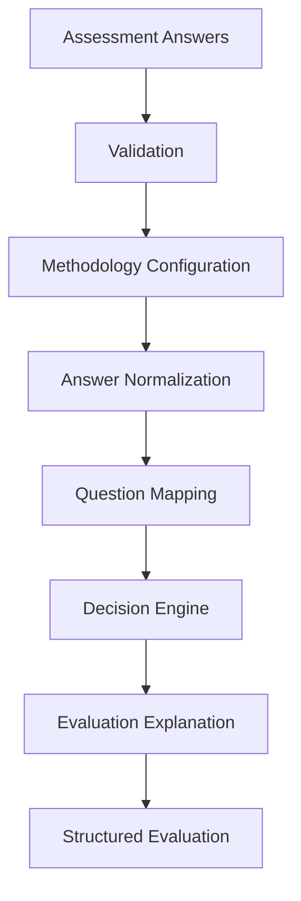
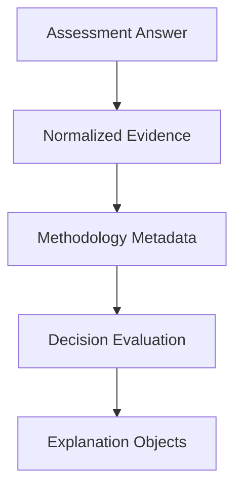

# Assessment Decision Engine v2

## Purpose

The Assessment Decision Engine is the deterministic business evaluation layer for
the Nguyen AI Executive Intelligence Platform. It exists to transform validated
assessment answers into structured, explainable business evaluation data that can
be consumed by future executive intelligence capabilities.

The business problem it solves is evidence translation. A submitted assessment
contains operational facts, maturity indicators, and business signals. The
Decision Engine converts those inputs into normalized readiness evaluation data
without using opaque AI reasoning, probabilistic scoring, or hidden business
logic.

The engine is intentionally not a narrative generator, recommendation engine, or
black-box scoring service. It provides the governed evaluation foundation that
future reporting, recommendation, confidence, and portfolio intelligence
components can consume.

## Current Processing Pipeline

Assessment Answers are submitted as validated question and answer pairs. They
represent business evidence collected from the assessment workflow.

Validation confirms that the submitted request is structurally acceptable before
the Decision Engine receives it. The current engine assumes it receives a
complete answer set that can be mapped to the canonical methodology
configuration.

Methodology Configuration is the authoritative source for business vocabulary.
It defines readiness dimensions, evidence categories, answer types, canonical
questions, placeholder weights, recommendation identifiers, service identifiers,
output schema references, and placeholder threshold values.

Answer Normalization converts configured numeric answer types into a shared
0-to-100 evaluation scale. The normalization range comes from methodology
configuration rather than hard-coded scoring rules.

Question Mapping translates submitted answers into `QuestionEvaluation` domain
objects by resolving the configured readiness dimension, evidence category,
answer type, and placeholder weight for each canonical question.

Decision Engine aggregation groups question evaluations by readiness dimension
and calculates deterministic weighted averages for each dimension and the
overall result.

Evaluation Explanation records the traceability metadata generated during
evaluation, including evaluated dimensions, contributing questions, applied
weights, normalized scores, evidence categories, and weight categories.

Structured Evaluation is the internal result object produced by the engine. It
contains the overall normalized score, dimension evaluations, question count,
total weight, and explanation metadata.

## Domain Models

Methodology Configuration defines the canonical business vocabulary used by the
engine. It owns readiness dimensions, evidence categories, answer type
definitions, weight categories, question definitions, placeholder question
weights, placeholder thresholds, service identifiers, recommendation priority
identifiers, and output schema metadata.

Question Evaluation represents a single evaluated question after configuration
mapping and answer normalization. It includes the question identifier, readiness
dimension, normalized score, applied weight, evidence category, and weight
category.

Dimension Evaluation represents aggregated evaluation data for one readiness
dimension. It includes the dimension identifier, normalized dimension score,
total applied weight, question count, and contributing question identifiers.

Decision Evaluation Result is the aggregate output from the Decision Engine. It
includes the overall normalized score, total weight, total question count,
dimension evaluations, and evaluation explanation metadata.

Question Explanation records the traceability metadata for an evaluated
question. It identifies the question, readiness dimension, evidence category,
weight category, applied weight, and normalized score used by the engine.

Dimension Explanation records the traceability metadata for a readiness
dimension. It identifies the dimension, contributing questions, applied question
weights, normalized dimension score, and total dimension weight.

Evaluation Explanation is the top-level explanation object attached to the
evaluation result. It identifies all evaluated dimensions, all contributing
questions, applied weights by question, question explanations, and dimension
explanations.

## Methodology Flow

The Decision Engine is configuration-driven. Business metadata originates in the
methodology configuration, and the engine executes that methodology without
duplicating business rules.

Answer types define whether an answer can be normalized and, when normalizable,
the configured minimum and maximum values. Current normalizable answer types use
configured ranges to convert submitted values to the common normalized scale.

Normalization is deterministic. A submitted numeric value is interpreted only in
the context of its configured answer type range and converted to the shared
0-to-100 scale. The engine rejects non-normalizable answer types during this
increment rather than inferring business meaning that is not yet approved.

Dimension mapping is driven by each canonical question definition. The engine
does not infer a readiness dimension from question naming, answer content, or
external context.

Weighting is driven by placeholder question weights in methodology
configuration. The current weights are intentionally placeholders so future
approved weighting methodology can replace them without changing the aggregation
architecture.

Deterministic aggregation calculates weighted averages from normalized question
evaluations. Dimension scores are calculated from questions mapped to each
dimension. The overall score is calculated from all evaluated questions.

## Explanation Model

The explanation model is assembled from the same deterministic evaluation data
used to calculate scores. It does not create new business decisions, alter
scores, or generate recommendations.

For each evaluated question, the engine records the question identifier,
readiness dimension, evidence category, weight category, applied weight, and
normalized score. This allows a future consumer to explain how an assessment
answer contributed to a readiness dimension and overall evaluation.

For each readiness dimension, the engine records contributing question
identifiers, applied weights, normalized dimension score, and total dimension
weight. This supports transparent review of how dimension-level results were
constructed.

At the evaluation level, the engine records the complete set of evaluated
dimensions, contributing questions, applied weights, question explanations, and
dimension explanations. This creates an audit-friendly trace from submitted
evidence to structured evaluation output.

## Architectural Principles

Deterministic: identical validated inputs and methodology configuration produce
identical outputs.

Explainable: evaluation outputs include traceability metadata that identifies
the questions, dimensions, weights, and normalized scores used by the engine.

Configuration-driven: business vocabulary, answer type ranges, question
metadata, and placeholder weights are owned by methodology configuration.

Traceable: each evaluated question can be connected to methodology metadata and
the dimension result it contributes to.

Reproducible: outputs can be regenerated from the same assessment answers and
methodology configuration.

Enterprise quality: implementation is organized around typed domain models,
small deterministic functions, validation, and unit tests.

Governance friendly: current outputs preserve the evidence and configuration
metadata needed by future audit, review, and release governance processes.

Testable: aggregation, mapping, normalization, and explanation metadata are
covered by deterministic unit tests.

## Extension Points

Recommendation Engine can consume structured evaluation and explanation metadata
to produce deterministic recommendations. It should use the Decision Engine
output as evidence and should not replace evaluation logic.

Confidence Methodology can consume answer completeness, evidence coverage,
normalization metadata, and explanation objects to calculate deterministic
confidence. It should remain a consumer of evaluated evidence.

Executive Reports can consume structured evaluation, explanation metadata,
confidence results, and recommendation outputs to generate executive-friendly
reporting. Report generation should not introduce new scoring logic.

Evidence Intelligence can extend traceability by linking assessment responses to
supporting evidence records, documents, interviews, or operational data. It
should enrich the evidence layer while preserving deterministic evaluation.

Snapshot Generation can assemble the future Business Readiness Snapshot from
Decision Engine output and downstream deterministic components.

Portfolio Intelligence can aggregate multiple assessment evaluations across
clients, business units, or time periods. It should consume versioned Decision
Engine outputs rather than redefining assessment methodology.

## Current Limitations

AI reasoning does not exist in the current Decision Engine.

Recommendation generation does not exist in the current Decision Engine.

Executive summaries do not exist in the current Decision Engine.

Report generation does not exist in the current Decision Engine.

Persistence does not exist in the current Decision Engine.

Confidence scoring does not exist in the current Decision Engine.

Evidence ingestion does not exist in the current Decision Engine.

Business Readiness Snapshot generation does not exist in the current Decision
Engine.

Final production weighting rules do not exist yet. The current engine uses
placeholder question weights from methodology configuration.

Final threshold-based readiness interpretation does not exist yet. Placeholder
thresholds are present in configuration for future approved methodology.

## Sprint History

Sprint 1: Business Decision Methodology Configuration established the canonical
business vocabulary, including readiness dimensions, evidence categories,
question identifiers, answer types, recommendation identifiers, service
identifiers, output schema references, placeholder thresholds, and placeholder
question weights.

Sprint 2 Increment 1: Deterministic Aggregation created the core Decision Engine
models and weighted aggregation behavior for question evaluations, dimension
evaluations, and overall evaluation results.

Sprint 2 Increment 2: Configuration-driven Mapping connected submitted
assessment answers to canonical methodology configuration and produced
`QuestionEvaluation` objects without duplicating business metadata.

Sprint 2 Increment 3: Configuration-driven Answer Normalization moved answer
type ranges into methodology configuration and normalized configured numeric
answers to a common scale.

Sprint 2 Increment 4: Deterministic Evaluation Explanation added explanation
metadata for evaluated dimensions, contributing questions, applied weights,
question explanations, and dimension explanations.

## Sprint 3 Objectives

Sprint 3 should remain focused on consuming Decision Engine output rather than
redesigning evaluation logic.

Business Readiness Snapshot work may assemble the future executive-facing output
model from structured evaluation data, explanation metadata, and approved
business interpretation rules.

Confidence Methodology work may define deterministic confidence factors such as
assessment completeness, answer consistency, evidence coverage, response
quality, and business certainty.

Recommendation Priority Framework work may map evaluated readiness gaps and
risk signals to deterministic priority levels after the approved recommendation
rules are implemented.

Executive Reporting work may translate structured evaluation, confidence, and
recommendation outputs into reproducible executive communication artifacts.

## Design Philosophy

The Assessment Service is not a scoring engine.

It is the deterministic Business Decision Engine that transforms validated
business evidence into explainable executive intelligence.

Future platform capabilities should consume this engine rather than replace it.
The engine is the governed source of deterministic business evaluation, while
future components such as recommendations, confidence, reporting, evidence
intelligence, and portfolio intelligence should build on top of its structured
and traceable outputs.
