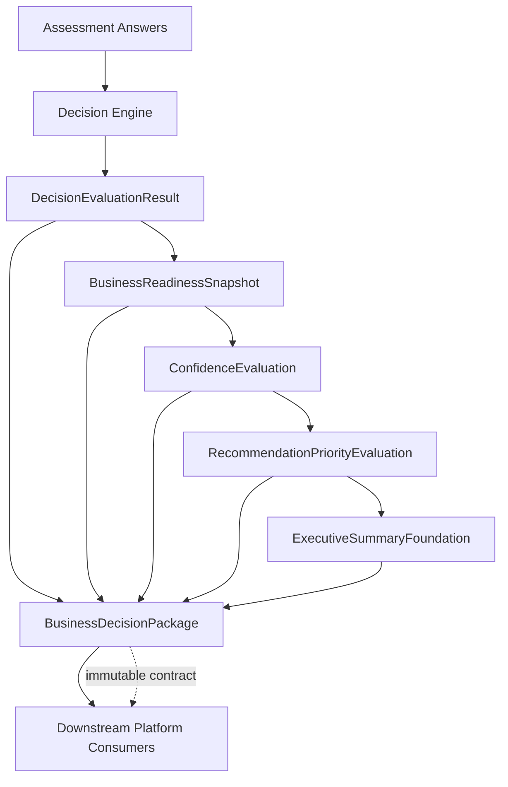

# Business Decision Package Contract v1

## Purpose

This document defines the Business Decision Package as the canonical immutable
output contract of the Nguyen AI Assessment Service.

The Assessment Service is the deterministic Business Decision Engine for the
Nguyen AI Executive Intelligence Platform. Its responsibility is to transform
validated executive assessment inputs into deterministic, explainable,
traceable, reproducible business decision outputs.

The Business Decision Package exists to package the deterministic outputs that
already exist after Sprint 3 into one governed contract. It does not create new
business conclusions, reinterpret existing evaluation, generate
recommendations, produce executive narratives, route services, or expose an API.

## Architectural Context

The frozen Decision Engine v2 architecture remains unchanged:

```text
Assessment Answers
  ->
Validation
  ->
Methodology Configuration
  ->
Answer Normalization
  ->
Question Mapping
  ->
Decision Engine
  ->
Evaluation Explanation
  ->
Structured Evaluation
  ->
DecisionEvaluationResult
```

Sprint 3 added deterministic downstream foundation outputs:

```text
DecisionEvaluationResult
  ->
BusinessReadinessSnapshot
  ->
ConfidenceEvaluation
  ->
RecommendationPriorityEvaluation
  ->
ExecutiveSummaryFoundation
```

The Business Decision Package is the Sprint 4 architectural contract that
packages these existing outputs into one immutable object for downstream
consumers.



Downstream platform consumers may read the package. They may not mutate the
deterministic outputs produced by the Assessment Service.

## Repository Responsibility

The Assessment Service owns:

- Internal executive assessment methodology execution.
- Deterministic Decision Engine evaluation.
- Configuration-driven answer normalization.
- Configuration-driven question mapping.
- Dimension and overall evaluation.
- Evaluation explanation metadata.
- Business Readiness Snapshot foundation output.
- Confidence Methodology Foundation output.
- Recommendation Priority Foundation output.
- Executive Summary Foundation output.
- Business Decision Package contract assembly.

The Assessment Service ends at deterministic business decision outputs. It
does not own downstream engagement, reporting, workflow, portfolio, or evidence
management capabilities.

## Assessment Service Boundary

The Assessment Service boundary is governed by the following rules:

- The public 12-question directional assessment and the internal 48-question
  executive assessment remain separate products and contracts.
- The Business Decision Package applies to the internal executive assessment
  path only.
- Public directional assessment IDs must not be silently mapped into canonical
  methodology IDs.
- The package must not change Decision Engine evaluation behavior.
- The package must not recalculate readiness scores, dimension scores,
  confidence foundation values, recommendation priority foundation values, or
  executive summary foundation values.
- The package must not introduce final recommendation generation, final service
  decisions, or executive report generation.

## Why the Business Decision Package Exists

The Business Decision Package exists to provide a stable contract between the
deterministic Assessment Service and downstream platform services.

It creates business value by:

- Giving downstream systems one canonical package to consume.
- Preserving traceability from evaluation to foundation outputs.
- Reducing ambiguity about which repository owns deterministic assessment
  outputs.
- Preventing downstream consumers from recomputing or altering source
  evaluation.
- Supporting audit, release governance, and future compatibility.

It creates executive value by:

- Preserving a defensible chain from assessment evidence to structured
  decision outputs.
- Keeping executive intelligence reproducible.
- Preventing black-box or opinion-based interpretation from entering the
  deterministic assessment layer.

## Canonical BusinessDecisionPackage Definition

The canonical Business Decision Package conceptually contains:

```text
BusinessDecisionPackage
  |
  |-- DecisionEvaluationResult
  |-- BusinessReadinessSnapshot
  |-- ConfidenceEvaluation
  |-- RecommendationPriorityEvaluation
  |-- ExecutiveSummaryFoundation
  |-- Audit
  |-- Limitations
  |-- VersionMetadata
```

### DecisionEvaluationResult

The deterministic evaluation output produced by the Decision Engine. It is the
source of readiness evaluation truth.

### BusinessReadinessSnapshot

The passive projection of `DecisionEvaluationResult` into internal
executive-facing readiness structure. It preserves source readiness values.

### ConfidenceEvaluation

The deterministic confidence foundation output. It consumes
`BusinessReadinessSnapshot` and exposes configured confidence factor metadata
and explicit limitations.

### RecommendationPriorityEvaluation

The deterministic recommendation priority foundation output. It consumes
`BusinessReadinessSnapshot`, `ConfidenceEvaluation`, and methodology
configuration. It exposes configured priority levels and factors without
assigning final priority or generating recommendations.

### ExecutiveSummaryFoundation

The deterministic executive summary foundation output. It consumes
`BusinessReadinessSnapshot`, `ConfidenceEvaluation`,
`RecommendationPriorityEvaluation`, and methodology configuration. It exposes
configured summary sections without generating narrative text or executive
reports.

### Audit

Audit metadata that identifies source artifacts, evaluated dimensions,
question counts, methodology version, output construction metadata, and
traceability references.

### Limitations

Explicit limitation metadata describing which final capabilities are not
implemented or not approved for current use.

### VersionMetadata

Version metadata that identifies the package contract version, methodology
version, assessment version, and component versions required for deterministic
reproduction and downstream compatibility.

## Component Ownership

| Component | Owning Layer | Mutability | Notes |
| --- | --- | --- | --- |
| `DecisionEvaluationResult` | Decision Engine | Immutable after creation | Source evaluation truth. |
| `BusinessReadinessSnapshot` | Snapshot Foundation | Immutable after creation | Passive projection of evaluation. |
| `ConfidenceEvaluation` | Confidence Foundation | Immutable after creation | Foundation metadata only. |
| `RecommendationPriorityEvaluation` | Recommendation Priority Foundation | Immutable after creation | No final priority assignment. |
| `ExecutiveSummaryFoundation` | Executive Summary Foundation | Immutable after creation | No narrative or report generation. |
| `Audit` | Business Decision Package | Immutable after creation | Captures trace and construction metadata. |
| `Limitations` | Business Decision Package | Immutable after creation | Captures current scope limits. |
| `VersionMetadata` | Business Decision Package | Immutable after creation | Captures package and component versions. |

Downstream services own any interpretation, visualization, workflow, evidence
storage, reporting, portfolio aggregation, or client experience that consumes
the package.

## Package Immutability Rules

The Business Decision Package is immutable once created.

Required immutability rules:

- Package components must not be modified by downstream consumers.
- Downstream services must treat package contents as read-only facts.
- Any corrected or recalculated output requires a new package instance.
- Package version metadata must remain attached to the package for its full
  lifecycle.
- Audit metadata must remain attached to the package for its full lifecycle.
- Limitations must remain visible to downstream consumers.
- Consumers must not remove or hide current limitations when displaying or
  transforming package data.

If downstream systems enrich package outputs, that enrichment must be stored as
separate downstream metadata and must not overwrite Assessment Service outputs.

## Versioning Principles

The package contract must be versioned independently from implementation
details.

Versioning principles:

- The contract version identifies the Business Decision Package shape.
- The methodology version identifies the governed methodology used to produce
  deterministic outputs.
- The assessment version identifies the assessment input contract.
- Component versions identify package components and foundation outputs.
- Backward-incompatible package shape changes require a new contract version.
- Methodology changes require governed documentation, configuration, and tests
  before they can affect package output.
- Version metadata must be included in the package so downstream consumers can
  validate compatibility.

Versioning must preserve reproducibility: the same inputs, methodology version,
configuration, and component versions must produce the same deterministic
package contents.

## Downstream Consumer Rules

Downstream consumers may:

- Read Business Decision Package contents.
- Display deterministic outputs with proper labels and limitations.
- Link package outputs to evidence repositories or reporting systems.
- Store package references for workflow, audit, or portfolio purposes.
- Enrich package data in separate downstream-owned records.

Downstream consumers may not:

- Modify package contents.
- Recompute Decision Engine outputs.
- Override readiness scores or dimension scores.
- Treat foundation limitations as final recommendations.
- Generate executive recommendations inside the Assessment Service contract.
- Route services inside the Assessment Service contract.
- Use AI or LLM reasoning to change deterministic package outputs.
- Hide limitations from executive or downstream consumers.

## Governance Principles

The Business Decision Package must remain:

- Deterministic.
- Explainable.
- Traceable.
- Reproducible.
- Configuration-driven.
- Auditable.
- Testable.
- Governance friendly.

Governance requirements:

- Methodology configuration remains the authoritative source for business
  vocabulary.
- The Decision Engine remains the authoritative source of readiness evaluation.
- Sprint 3 foundation outputs remain passive consumers of source artifacts.
- Package assembly must not introduce hidden business rules.
- Package assembly must not introduce formulas, thresholds, weights, priority
  assignments, recommendation generation, or service decisions.
- Package assembly must preserve explicit limitations.
- Future changes must be delivered through small, versioned, testable
  increments.

## Explicit Out-of-Scope Responsibilities

The Assessment Service and Business Decision Package do not own:

- Evidence ingestion.
- Evidence repositories.
- Executive dashboards.
- Executive reports.
- Portfolio Intelligence.
- Workflow orchestration.
- Case management.
- AI-generated reasoning.
- Bedrock decision making.
- Recommendation generation.
- Service routing.
- Service tier selection.
- Public directional assessment scoring.
- Public-to-executive assessment translation.
- Customer-facing presentation logic.

These capabilities belong to downstream platform services or separately
governed future increments.

## Relationship to the Executive Intelligence Platform

The Business Decision Package is the handoff contract from the deterministic
Assessment Service to the broader Nguyen AI Executive Intelligence Platform.

Within the platform:

- The Assessment Service produces deterministic business decision outputs.
- Evidence Intelligence may link package outputs to supporting evidence.
- Executive Reporting may translate package contents into approved executive
  communication artifacts.
- Portfolio Intelligence may aggregate versioned package outputs across
  clients, business units, or time.
- Dashboards may display package contents and downstream enrichment.

The package allows these downstream capabilities to evolve without replacing
or redefining Assessment Service evaluation.

## Future Evolution Guidelines

Future evolution must preserve the package as the immutable Assessment Service
output contract.

Guidelines:

- Add fields only through versioned contract changes.
- Add business methodology only through approved documentation,
  configuration, and tests.
- Keep downstream enrichment separate from package contents.
- Preserve explicit limitations until the corresponding governed capability is
  implemented.
- Keep public and executive assessment contracts separate.
- Keep package assembly separate from API, persistence, reporting, and
  dashboard concerns unless a future approved architecture explicitly defines
  those boundaries.
- Validate every future package change with deterministic contract tests.

Future capabilities may consume the package, but they must not require the
Decision Engine to be redesigned.

## Non-Goals

The Business Decision Package Contract v1 does not:

- Define Python implementation details.
- Define API routes or request/response handlers.
- Define persistence storage.
- Define downstream evidence repositories.
- Define dashboard behavior.
- Define executive report format.
- Define narrative generation.
- Define recommendation generation.
- Define service routing.
- Define final confidence formulas.
- Define final confidence-level assignment.
- Define final recommendation priority assignment.
- Change Sprint 3 behavior.
- Change the public/executive assessment boundary.
- Redesign the Decision Engine.

This document establishes the architecture contract that future Sprint 4
implementation work must conform to before implementation begins.
