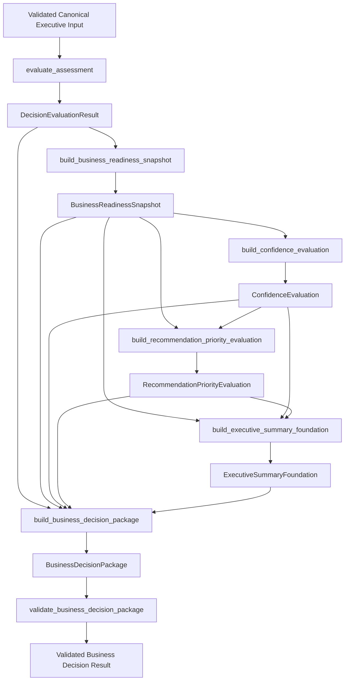

# Executive Runtime Orchestration Architecture v1

## Purpose

This document defines the orchestration architecture for coordinating the
existing deterministic executive assessment components of the Nguyen AI
Assessment Service.

The core question answered by this document is:

Once a future executive input has been validated and canonicalized, how should
the Assessment Service coordinate the existing deterministic components to
produce and validate a `BusinessDecisionPackage`?

This document defines orchestration responsibility only. It does not implement
an orchestrator, define an API, modify the Lambda handler, change methodology,
or make the executive pipeline production-authoritative.

## Scope

This document applies only to the future internal executive assessment path.

In scope:

- Orchestration ownership.
- Required orchestration entry guarantees.
- Sequencing of existing deterministic components.
- Component dependency graph.
- Failure and partial-result policy.
- Immutability, determinism, version propagation, and limitations propagation.
- Separation between orchestration and runtime adapters.

Out of scope:

- Public 12-question directional assessment behavior.
- Public-to-executive translation.
- API routes or HTTP response contracts.
- Lambda handler changes.
- Persistence, delivery envelopes, dashboards, reports, and downstream platform
  concerns.
- Methodology decisions that remain pending after Sprint 5.2.

## Governing Baselines

This document is governed by:

- `AGENTS.md`
- `docs/architecture/executive-runtime-readiness-architecture-v1.md`
- `docs/architecture/executive-methodology-completeness-audit-v1.md`
- `docs/architecture/executive-assessment-input-contract-v1.md`
- `docs/architecture/assessment-boundary-architecture-v1.md`
- `docs/architecture/business-decision-package-contract-v1.md`
- `docs/architecture/business-decision-package-serialization-contract-v1.md`
- `docs/architecture/business-decision-package-versioning-v1.md`
- `docs/releases/sprint3-foundation-complete-v1.md`
- `docs/releases/sprint4-business-decision-package-foundation-complete-v1.md`

Sprint 3 and Sprint 4 behavior and contracts remain frozen.

## Current Runtime State

The current Lambda runtime remains the placeholder production path:

```text
POST /assessment
  -> handle_assessment()
  -> validate_assessment_request()
  -> AssessmentRequest
  -> score_assessment()
  -> AssessmentResponse
```

Current runtime characteristics:

- `handle_assessment()` creates a runtime request ID.
- `validate_assessment_request()` validates the placeholder request contract.
- `score_assessment()` returns a deterministic placeholder response.
- `AssessmentResponse` contains placeholder readiness output.
- The runtime does not invoke `evaluate_assessment()`.
- The runtime does not build Sprint 3 foundation outputs.
- The runtime does not assemble or validate a `BusinessDecisionPackage`.

Repository evidence:

- `src/assessment/handler.py`
- `src/assessment/validation.py`
- `src/assessment/scoring.py`
- `src/assessment/models.py`
- `tests/test_handler.py`
- `tests/test_scoring.py`

## Future Executive Runtime Boundary

A future executive runtime boundary must remain layered:

```text
HTTP / API / Lambda adapter
  -> runtime-specific parsing
  -> executive input validation and canonicalization
  -> runtime orchestration
  -> deterministic domain pipeline
  -> runtime response adapter
```

The orchestrator begins only after executive input has already been validated
and canonicalized according to `Executive Assessment Input Contract v1`.

The orchestrator must not accept:

- Raw HTTP events.
- Current placeholder `AssessmentRequest` objects.
- Public directional assessment payloads.
- Request IDs.
- Runtime timestamps.
- API Gateway metadata.
- Persistence metadata.
- Raw source payloads.

## Orchestration Principles

Orchestration coordinates. Orchestration does not decide.

The orchestration layer may:

- Invoke existing deterministic domain components.
- Pass immutable outputs between components.
- Enforce required sequencing.
- Stop on failures.
- Assemble existing outputs using approved builders.
- Invoke package validation.
- Return a successful deterministic domain result or an explicit domain
  failure.

The orchestration layer must not:

- Calculate scores.
- Normalize answers.
- Define question mappings.
- Assign weights.
- Assign readiness levels.
- Calculate confidence.
- Assign recommendation priority.
- Generate recommendations.
- Select services.
- Create executive conclusions.
- Rewrite component outputs.
- Reinterpret deterministic results.
- Contain methodology rules.
- Contain API, HTTP, persistence, or delivery behavior.
- Invoke Bedrock, LLMs, or AI models for business reasoning.

## Orchestrator Ownership

Decision status:

- DECIDED: orchestration belongs in an Assessment Service application/domain
  service layer.
- DECIDED: orchestration does not belong in the Decision Engine.
- DECIDED: orchestration does not belong in the Lambda handler.
- DECIDED: orchestration is not a downstream platform concern because it
  coordinates Assessment Service-owned deterministic domain outputs into the
  Assessment Service-owned `BusinessDecisionPackage`.

Rationale:

The Decision Engine owns deterministic evaluation truth: methodology execution,
normalization, question mapping, dimension aggregation, and explanation
metadata. Runtime orchestration has a different responsibility: sequencing
already-approved deterministic components after validated input and before
runtime response adaptation.

Lambda and API adapters should remain transport-specific. Placing orchestration
inside the handler would mix deterministic domain coordination with HTTP,
CORS, request ID, and response concerns.

## Orchestrator Entry Guarantees

Before orchestration begins, a future executive input boundary must provide:

- Accepted executive assessment contract identity.
- Deterministic methodology version binding.
- Complete canonical answer set for all 48 configured executive questions.
- Exactly one answer per canonical question ID.
- No unknown question IDs.
- No duplicate question IDs.
- No public directional question IDs.
- No hidden aliases, inference, or translations.
- Type-valid and range-valid answer values.
- Stable immutable answer representation.

These guarantees are defined by `Executive Assessment Input Contract v1`.
The orchestrator may rely on them, while downstream components may continue
defensive validation of their own invariants.

## Repository-Grounded Dependency Graph



| Stage | Input Type | Output Type | Dependency | Current Readiness | Failure Boundary |
| --- | --- | --- | --- | --- | --- |
| Decision Engine | Canonical answer mapping and methodology config | `DecisionEvaluationResult` | Methodology configuration | `IMPLEMENTATION_READY` for foundation behavior | Raises deterministic validation errors for invalid answers/configuration. |
| Snapshot | `assessment_version`, `DecisionEvaluationResult`, methodology config | `BusinessReadinessSnapshot` | Decision Engine output | `FOUNDATION_COMPLETE` | Raises on invalid version, missing explanation, unknown dimensions, or mismatched explanation metadata. |
| Confidence | `BusinessReadinessSnapshot`, methodology config | `ConfidenceEvaluation` | Snapshot output | `FOUNDATION_COMPLETE` with `METHODOLOGY_PENDING` final formulas | Raises on methodology mismatch or invalid snapshot metadata. |
| Recommendation Priority | Snapshot, confidence, methodology config | `RecommendationPriorityEvaluation` | Snapshot and confidence outputs | `FOUNDATION_COMPLETE` with `METHODOLOGY_PENDING` final assignment | Raises on version mismatch or incomplete/unknown confidence factors. |
| Executive Summary | Snapshot, confidence, priority, methodology config | `ExecutiveSummaryFoundation` | Snapshot, confidence, priority outputs | `FOUNDATION_COMPLETE` with `METHODOLOGY_PENDING` narratives/report rules | Raises on source version or methodology mismatch. |
| Package Assembly | Decision evaluation, snapshot, confidence, priority, summary | `BusinessDecisionPackage` | All upstream deterministic outputs | `FOUNDATION_COMPLETE` for structure | Raises on source version mismatch or decision/snapshot mismatch. |
| Package Validation | `BusinessDecisionPackage` | `BusinessDecisionPackageValidationResult` | Package contract | `FOUNDATION_COMPLETE` for contract integrity | Returns structured validation issues. |

## Decision Engine Stage

The orchestrator passes the canonical executive answer mapping to:

```text
evaluate_assessment(answers, methodology_config)
```

Expected inputs:

- `answers`: mapping from canonical executive question ID to answer value.
- `methodology_config`: governed `BusinessDecisionMethodologyConfig`.

The Decision Engine:

- Validates methodology configuration.
- Rejects unknown question IDs.
- Rejects missing required questions.
- Loads configured question definitions.
- Loads configured answer types.
- Validates numeric answer type and range for current evaluable questions.
- Normalizes answers deterministically.
- Applies configured placeholder question weights.
- Aggregates dimension and overall scores.
- Builds explanation metadata.

The orchestrator must not duplicate any of those responsibilities.

## BusinessReadinessSnapshot Stage

The orchestrator passes the Decision Engine result to:

```text
build_business_readiness_snapshot(
    assessment_version,
    decision_evaluation,
    methodology_config,
)
```

The snapshot stage consumes `DecisionEvaluationResult` and projects readiness
information into an executive-facing structure.

The snapshot stage:

- Preserves the Decision Engine overall score.
- Preserves dimension scores.
- Preserves question counts and total weights.
- Adds configured dimension labels.
- Records methodology version in audit metadata.
- Requires evaluation explanation metadata.

The snapshot stage does not introduce new business decisions, thresholds,
readiness levels, confidence, priority, recommendations, or narratives.

## ConfidenceEvaluation Stage

The orchestrator passes the snapshot to:

```text
build_confidence_evaluation(snapshot, methodology_config)
```

The confidence stage currently:

- Consumes `BusinessReadinessSnapshot`.
- Validates snapshot methodology consistency.
- Evaluates foundation confidence factors for assessment completeness and
  evidence coverage.
- Marks remaining confidence factors as `not-evaluated`.
- Preserves snapshot readiness outputs unchanged.

Current limitation:

Final confidence formulas and final confidence-level assignment remain
`METHODOLOGY_PENDING`. The orchestrator must preserve that foundation status
and must not upgrade confidence output to authoritative confidence.

## RecommendationPriorityEvaluation Stage

The orchestrator passes snapshot and confidence outputs to:

```text
build_recommendation_priority_evaluation(
    snapshot,
    confidence,
    methodology_config,
)
```

The recommendation priority stage currently:

- Consumes `BusinessReadinessSnapshot`.
- Consumes `ConfidenceEvaluation`.
- Exposes configured priority levels.
- Exposes configured priority factors.
- Marks all priority factors as `not-evaluated`.
- Records source snapshot and confidence metadata.

Current limitation:

Executable priority formulas, final priority assignment, recommendation
targets, recommendation generation, service decisions, and service tier
selection are not approved. The orchestrator must not compensate for
`not-evaluated` priority factors.

## ExecutiveSummaryFoundation Stage

The orchestrator passes snapshot, confidence, and priority outputs to:

```text
build_executive_summary_foundation(
    snapshot,
    confidence,
    priority,
    methodology_config,
)
```

The executive summary foundation currently:

- Consumes snapshot, confidence, and priority outputs.
- Exposes configured executive summary sections.
- Marks all summary sections as `not-evaluated`.
- Records source metadata from upstream foundation outputs.

Current limitation:

Narrative generation, executive reporting rules, recommendation generation,
and service decisions are not approved. The orchestrator must not generate
prose, fill unevaluated sections, or create executive conclusions.

## BusinessDecisionPackage Assembly Stage

The orchestrator passes all deterministic component outputs to:

```text
build_business_decision_package(
    decision_evaluation,
    business_readiness_snapshot,
    confidence_evaluation,
    recommendation_priority_evaluation,
    executive_summary_foundation,
)
```

Package assembly currently:

- Preserves all contained Sprint 2, Sprint 3, and Sprint 4 objects.
- Validates source assessment version consistency.
- Validates source methodology version consistency.
- Validates decision/snapshot score, question count, total weight, and
  dimension alignment.
- Adds package audit metadata.
- Adds Business Decision Package limitations.
- Adds contract version and component version metadata.

The orchestrator must not duplicate package identity, audit, limitations,
serialization ordering, or versioning rules.

## BusinessDecisionPackageValidation Stage

The orchestrator must invoke:

```text
validate_business_decision_package(package)
```

after package assembly and before returning a successful orchestration result.

Successful orchestration requires:

- Component execution success.
- Package assembly success.
- Package structural validation success.

The following remain separate and must not be collapsed:

- Component execution success.
- Package assembly success.
- Package structural validity.
- Methodology eligibility.
- Runtime eligibility.
- Production authority.

A structurally valid package can remain foundation-level and
methodology-pending.

## Failure Semantics

Runtime orchestration should be fail-fast.

Failure categories:

| Failure | Required Orchestration Behavior |
| --- | --- |
| Invalid canonical input reaches orchestration | Stop before Decision Engine invocation and return explicit domain/application failure. |
| Decision Engine failure | Stop; do not build snapshot, confidence, priority, summary, or package. |
| Snapshot construction failure | Stop; do not build downstream foundation outputs or package. |
| Confidence construction failure | Stop; do not build priority, summary, or package. |
| Priority construction failure | Stop; do not build summary or package. |
| Executive summary construction failure | Stop; do not assemble package. |
| Package assembly failure | Stop; do not return package as successful result. |
| Package validation failure | Stop; return explicit package-validation failure and do not classify orchestration as successful. |

This document does not define HTTP status codes or API error bodies.
Runtime adapters may translate domain/application failures later, but they must
not hide or reinterpret deterministic failure causes.

## Partial Result Policy

Decision status:

- DECIDED: successful orchestration must not return partial packages.
- DECIDED: a `BusinessDecisionPackage` is returned as a successful result only
  after package validation succeeds.
- DECIDED: intermediate component outputs may be useful for diagnostics in
  future implementation, but they are not a successful Business Decision
  Package result.
- OPEN: whether future internal failure objects include diagnostic references
  to intermediate outputs remains undecided.

Rationale:

The package contract depends on component completeness, source consistency, and
validation. Returning partial results as successful outputs would weaken
package integrity and downstream consumer trust.

## Immutability Rules

The orchestrator must not mutate upstream or downstream domain objects.

Required rules:

- Validated canonical input is treated as immutable.
- `DecisionEvaluationResult` is passed unchanged to snapshot and package
  assembly.
- `BusinessReadinessSnapshot` is passed unchanged to confidence, priority,
  summary, and package assembly.
- `ConfidenceEvaluation` is passed unchanged to priority, summary, and package
  assembly.
- `RecommendationPriorityEvaluation` is passed unchanged to summary and package
  assembly.
- `ExecutiveSummaryFoundation` is passed unchanged to package assembly.
- `BusinessDecisionPackage` is passed unchanged to package validation.

Any future orchestrator tests should verify that contained outputs are
preserved and not recomputed or mutated.

## Determinism / Idempotency

For identical validated executive input, identical methodology configuration,
and identical component versions, orchestration must produce identical domain
outputs.

The orchestrator must not introduce:

- Runtime-generated IDs.
- UUIDs.
- Timestamps.
- Session identifiers.
- API Gateway metadata.
- Persistence keys.
- Random ordering.
- External service calls.

Idempotency here means deterministic reproducibility of domain outputs. It does
not define HTTP retry semantics, persistence idempotency keys, or delivery
semantics.

## Version Propagation

Current version propagation:

- `assessmentVersion` originates from the future validated executive input
  contract.
- `methodologyVersion` originates from `BUSINESS_DECISION_METHODOLOGY.version`.
- `DecisionEvaluationResult` does not carry assessment version.
- `BusinessReadinessSnapshot` receives assessment version and writes
  methodology version into audit metadata.
- `ConfidenceEvaluation` copies assessment version from snapshot and
  methodology version from snapshot audit.
- `RecommendationPriorityEvaluation` copies assessment and methodology
  versions from snapshot/confidence sources.
- `ExecutiveSummaryFoundation` copies assessment and methodology versions from
  snapshot/confidence/priority sources.
- `BusinessDecisionPackage` copies assessment and methodology versions into
  package audit and version metadata.
- `BusinessDecisionPackage` adds package contract version and component
  versions.
- `BusinessDecisionPackageValidation` verifies version metadata and source
  consistency.

The orchestrator's role is to pass and coordinate existing version identity.
It must not invent, reinterpret, or duplicate package versioning rules.

Open version decisions from `Executive Assessment Input Contract v1` remain
open:

- Exact executive assessment version.
- Methodology version binding strategy.
- Separate input-contract version necessity.

## Limitations Propagation

Current limitation propagation:

- `ConfidenceEvaluation` marks factors without approved methodology as
  `not-evaluated` with limitation text.
- `RecommendationPriorityEvaluation` marks all priority factors as
  `not-evaluated` with foundation limitation text.
- `ExecutiveSummaryFoundation` marks all summary sections as `not-evaluated`
  with foundation limitation text.
- `BusinessDecisionPackage` includes package-level limitations covering final
  confidence formulas, final confidence-level assignment, final recommendation
  assignment, recommendation generation, service decisions, executive
  reporting, executive narratives, evidence ingestion, persistence, and API
  exposure.

The orchestrator must preserve limitations unchanged. It must not remove,
rewrite, hide, downgrade, or override limitation metadata.

## Public / Executive Separation

This orchestration architecture applies only to future validated canonical
executive input.

The orchestrator must never accept:

- Public 12-question directional assessment payloads.
- Website-owned public question IDs.
- Public directional answer values.
- Placeholder `AssessmentRequest` objects from the current runtime path.
- Public assessment results.
- Synthetic executive answers derived from public answers.

Any future translation from public directional assessment to executive
assessment requires a separate approved, versioned, governed methodology. It is
outside orchestration.

## Runtime Adapter Boundary

A future runtime adapter may:

- Parse HTTP/Lambda event structure.
- Apply CORS/authentication/runtime concerns.
- Validate or delegate validation of runtime request shape.
- Convert approved executive runtime payloads into canonical executive input.
- Translate orchestration domain failures into approved runtime responses.
- Translate successful validated package output into an approved response
  representation.

A runtime adapter must not:

- Contain methodology rules.
- Call individual downstream builders out of sequence.
- Recompute or modify orchestrated outputs.
- Add runtime metadata into the `BusinessDecisionPackage`.
- Treat Business Decision Package serialization as an API response contract
  without a separate approved runtime response contract.

## Orchestration Responsibility Matrix

| Concern | Owning Component | Orchestrator Responsibility | Orchestrator Prohibited Behavior | Current Readiness | Repository Evidence |
| --- | --- | --- | --- | --- | --- |
| Input validation | Future executive input boundary | Require validated canonical input before invocation. | Parse raw HTTP or accept public/placeholder requests. | Not implemented. | `docs/architecture/executive-assessment-input-contract-v1.md`. |
| Normalization | Decision Engine | Invoke `evaluate_assessment()`. | Normalize answers directly. | `IMPLEMENTATION_READY` for foundation behavior. | `src/assessment/decision_engine.py`. |
| Question mapping | Decision Engine and methodology config | Pass canonical answers and methodology config. | Define mappings or aliases. | `IMPLEMENTATION_READY` for foundation behavior. | `src/assessment/decision_engine.py`, `src/assessment/methodology_config.py`. |
| Scoring | Decision Engine | Consume returned `DecisionEvaluationResult`. | Calculate scores or assign readiness levels. | `IMPLEMENTATION_READY` with placeholder weights. | `src/assessment/decision_engine.py`, Sprint 5.2 audit. |
| Aggregation | Decision Engine | Preserve aggregate output. | Re-aggregate dimensions or overall score. | `IMPLEMENTATION_READY` for foundation behavior. | `src/assessment/decision_engine.py`. |
| Snapshot | Snapshot builder | Invoke `build_business_readiness_snapshot()`. | Recompute snapshot fields or introduce thresholds. | `FOUNDATION_COMPLETE`. | `src/assessment/snapshot.py`. |
| Confidence | Confidence builder | Invoke `build_confidence_evaluation()`. | Calculate final confidence score or level. | `FOUNDATION_COMPLETE`, final methodology pending. | `src/assessment/confidence.py`, Sprint 5.2 audit. |
| Recommendation priority | Priority builder | Invoke `build_recommendation_priority_evaluation()`. | Assign priority or generate recommendations. | `FOUNDATION_COMPLETE`, final methodology pending. | `src/assessment/recommendation_priority.py`. |
| Executive summary | Summary builder | Invoke `build_executive_summary_foundation()`. | Generate narratives or reports. | `FOUNDATION_COMPLETE`, final methodology pending. | `src/assessment/executive_summary.py`. |
| Package assembly | Package builder | Invoke `build_business_decision_package()`. | Duplicate identity, audit, limitations, or serialization rules. | `FOUNDATION_COMPLETE` for structure. | `src/assessment/business_decision_package.py`. |
| Package validation | Package validation module | Require validation success before successful result. | Ignore validation issues or mutate package to pass. | `FOUNDATION_COMPLETE` for contract integrity. | `src/assessment/business_decision_package_validation.py`. |
| Version identity | Component builders and package contract | Pass configured versions through sequence. | Invent UUIDs, timestamps, request IDs, or package identities. | Foundation complete; input version decisions open. | Package versioning docs, package module. |
| Limitations | Foundation builders and package contract | Preserve limitation metadata unchanged. | Hide or rewrite limitations. | Foundation complete. | Confidence, priority, summary, package modules. |
| API concerns | Future runtime adapter | Stay independent. | Return HTTP responses or define API body. | Not implemented. | Handler remains placeholder. |
| Persistence | Outside current Assessment Service scope | None. | Store packages or create database records. | Deferred. | Sprint 4 release baseline. |
| Delivery | Future downstream boundary, not 5.4 | None. | Create delivery envelope or transport metadata. | Deferred. | Sprint 5 planning constraints. |

## Successful Orchestration Result

Decision status:

- DECIDED: the natural successful internal orchestration result is a validated
  `BusinessDecisionPackage`.
- DECIDED: no delivery envelope, API response envelope, persistence record,
  request/result UUID, timestamp, or transport metadata is required for the
  orchestration result.
- DECIDED: package validation must succeed before the orchestrator returns a
  successful result.
- OPEN: whether a future implementation returns the package alone or a small
  internal result object containing both package and validation result remains
  an implementation detail. Such a result object must not become a new business
  decision contract without architecture approval.

## Readiness Implications

Approving orchestration architecture does not mean the executive runtime is
ready.

An implemented orchestrator in a future increment would establish application
coordination only. It would not automatically mean:

- Final methodology is approved.
- Placeholder weights are production-authoritative.
- Placeholder thresholds are production-authoritative.
- Confidence formulas are final.
- Recommendation priority assignment exists.
- Executive summary methodology is final.
- Runtime input contract decisions are closed.
- Runtime response contract is approved.
- API or Lambda integration is approved.
- Business Decision Package output is production-authoritative.

Runtime eligibility and production authority remain governed by the readiness
gates in `Executive Runtime Readiness Architecture v1`.

## Open Architecture Decisions

This orchestration analysis preserves the following open decisions from
`Executive Assessment Input Contract v1`:

- Exact executive `assessmentVersion`.
- Methodology version binding strategy.
- Separate input-contract version necessity.
- Incomplete/draft executive submission behavior.
- Organization metadata boundary.
- Respondent metadata boundary.
- Source metadata or audit-context boundary.
- Runtime route, adapter, or version separation.
- Future API response representation.
- Whether a future internal orchestration failure result includes diagnostic
  references to intermediate outputs.

No open input-contract decision is forced closed by this orchestration
architecture.

## Conditions Required Before Implementation

Before implementing an orchestration module, the repository needs:

- Approval that orchestration belongs in an Assessment Service
  application/domain service layer.
- Approval of the executive input contract identity and methodology binding
  strategy, or an explicit decision that implementation may accept those as
  injected values from a not-yet-runtime adapter.
- A deterministic internal failure result strategy.
- Tests planned for full sequencing, fail-fast behavior, no partial successful
  results, no mutation, version propagation, limitation propagation, package
  validation failure, and public/executive boundary enforcement.
- Confirmation that implementation will remain independent of Lambda, HTTP,
  API Gateway, persistence, and delivery concerns.

## Explicit Non-Goals

This document does not implement or define:

- Python orchestration module.
- Executive input Python model.
- API route.
- HTTP response contract.
- Lambda handler behavior.
- Public assessment behavior.
- Public-to-executive translation.
- Methodology changes.
- Weights.
- Thresholds.
- Confidence formulas.
- Recommendation formulas.
- Recommendation generation.
- Service routing.
- Executive narrative generation.
- Persistence.
- Database schema.
- Delivery envelope.
- Evidence repository.
- Dashboards.
- Portfolio Intelligence.
- Digital Twin.
- Bedrock or LLM reasoning.

## Recommended Next Increment

The recommended next increment is Sprint 5.5, Runtime Response Contract
Architecture.

That increment should decide how a future runtime adapter may represent
orchestration outcomes without treating Business Decision Package serialization
as an API contract by default.

It should remain architecture-only unless the executive input contract,
orchestration implementation prerequisites, and runtime eligibility gates are
explicitly approved.
