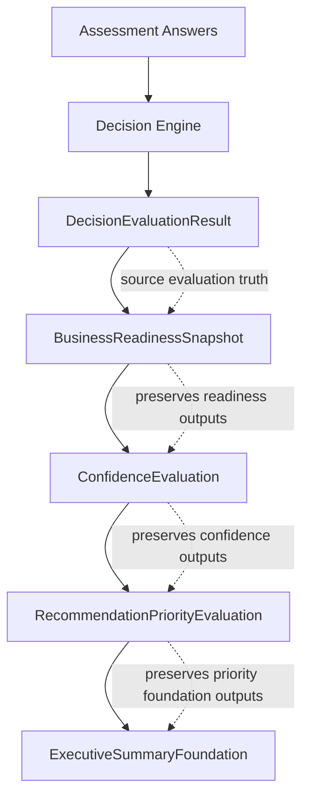

# Sprint 3 Foundation Complete v1

## Purpose

Sprint 3 established the deterministic foundation layers that sit downstream of
the Assessment Decision Engine. Its purpose was to turn the structured
`DecisionEvaluationResult` into governed executive-intelligence foundation
objects without changing scoring, introducing recommendations, generating
executive narratives, or exposing new API behavior.

The business capability established by Sprint 3 is traceable executive
intelligence assembly. The Assessment Service can now preserve deterministic
readiness evaluation and package it into foundation outputs for snapshot,
confidence, recommendation-priority, and executive-summary workflows. These
outputs are intentionally limited foundation artifacts that future governed
methodology can consume.

Sprint 3 did not turn the service into a narrative generator, recommendation
engine, reporting system, or service-routing system.

## Completed Foundations

### Business Readiness Snapshot Foundation

Purpose:

- Provide an internal executive-facing projection of readiness evaluation.
- Preserve `DecisionEvaluationResult` scores and dimension data without
  recomputation.

Inputs:

- Assessment version.
- `DecisionEvaluationResult`.
- Methodology configuration.

Outputs:

- `BusinessReadinessSnapshot`.
- Overall readiness projection.
- Domain readiness projections.
- Snapshot audit metadata.

Architecture role:

- Serves as the first downstream consumer of Decision Engine output.
- Provides the stable foundation object consumed by confidence, priority, and
  executive-summary foundations.

### Assessment Boundary Architecture

Purpose:

- Define the boundary between the public 12-question directional assessment and
  the internal 48-question executive assessment methodology.
- Prevent public assessment contracts from being silently treated as canonical
  executive methodology contracts.

Inputs:

- Website assessment positioning.
- Assessment Service architecture.
- Business Decision Methodology.

Outputs:

- `docs/architecture/assessment-boundary-architecture-v1.md`.
- Governed public/internal assessment boundary rules.

Architecture role:

- Protects the frozen Decision Engine v2 architecture.
- Preserves separate public and executive assessment contracts.

### Confidence Methodology Foundation

Purpose:

- Establish deterministic confidence foundation metadata as a separate concept
  from readiness.
- Expose configured confidence factors and evaluated foundation status without
  final confidence formulas.

Inputs:

- `BusinessReadinessSnapshot`.
- Methodology configuration.

Outputs:

- `ConfidenceEvaluation`.
- Evaluated confidence factors for assessment completeness and evidence
  coverage.
- Explicit limitations for factors that require future approved rules.

Architecture role:

- Consumes snapshot output without altering readiness scores.
- Provides confidence foundation metadata for future recommendations and
  executive reporting.

### Confidence Governance Alignment

Purpose:

- Synchronize architecture documentation after Confidence Methodology
  Foundation was implemented.
- Clarify which confidence behaviors exist and which remain intentionally
  unimplemented.

Inputs:

- Confidence foundation implementation.
- Boundary architecture documentation.

Outputs:

- Updated assessment boundary current-state and limitation language.

Architecture role:

- Keeps documentation aligned with repository behavior.
- Prevents final confidence formulas or confidence-level assignment from being
  represented as implemented.

### Recommendation Priority Foundation

Purpose:

- Establish governed priority-level and priority-factor vocabulary as a
  deterministic downstream foundation.
- Preserve snapshot and confidence outputs while making clear that executable
  priority assignment is not yet approved.

Inputs:

- `BusinessReadinessSnapshot`.
- `ConfidenceEvaluation`.
- Methodology configuration.

Outputs:

- `RecommendationPriorityEvaluation`.
- Configured priority levels.
- Configured priority factors.
- Source metadata and explicit limitation metadata.

Architecture role:

- Consumes snapshot and confidence outputs.
- Provides traceable priority foundation metadata without recommendation
  generation, priority assignment, escalation rules, or service routing.

### Executive Summary Foundation

Purpose:

- Establish governed executive-summary section vocabulary as a deterministic
  downstream foundation.
- Preserve source foundation outputs while making clear that executive narrative
  and report generation are not yet approved.

Inputs:

- `BusinessReadinessSnapshot`.
- `ConfidenceEvaluation`.
- `RecommendationPriorityEvaluation`.
- Methodology configuration.

Outputs:

- `ExecutiveSummaryFoundation`.
- Configured summary sections.
- Source snapshot, confidence, and priority metadata.
- Explicit limitation metadata.

Architecture role:

- Consumes all prior Sprint 3 foundation outputs.
- Prepares a governed boundary for future executive reporting without
  generating prose, recommendations, service decisions, or report artifacts.

## Architecture State

Final Sprint 3 architecture:

```text
Assessment Answers
  ->
Decision Engine
  ->
DecisionEvaluationResult
  ->
BusinessReadinessSnapshot
  ->
ConfidenceEvaluation
  ->
RecommendationPriorityEvaluation
  ->
ExecutiveSummaryFoundation
```



Each Sprint 3 foundation layer consumes the prior structured output and adds
bounded metadata for the next layer. None of the Sprint 3 foundation layers
replace, recompute, or reinterpret Decision Engine evaluation.

## Governance State

Deterministic behavior:

- Identical source inputs and methodology configuration produce identical
  foundation outputs.

Configuration-driven execution:

- Methodology configuration remains the authoritative source for readiness
  dimensions, confidence factors, recommendation priority levels,
  recommendation priority factors, executive summary sections, services,
  question metadata, placeholder weights, and placeholder thresholds.

Explainability:

- Foundation outputs expose source metadata, configured factor or section
  identifiers, and explicit limitation metadata.

Traceability:

- Outputs preserve traceability from Decision Engine evaluation to snapshot,
  confidence, recommendation-priority, and executive-summary foundation
  artifacts.

Reproducibility:

- Outputs can be regenerated from the same source artifacts and methodology
  configuration.

Architecture boundaries:

- The Decision Engine remains the governed source of deterministic evaluation.
- Sprint 3 foundation layers are downstream consumers.
- Public directional assessment behavior remains separate from internal
  executive assessment behavior.
- No AI, LLM, or Bedrock reasoning is used for decisions.

## Verification Results

Final Sprint 3 Verification Review result:

- Sprint 3 is complete and ready for completion tagging.

Validation results:

- Full test suite: 100 passing tests.
- Architecture compliance: passed.
- Governance compliance: passed.
- Test coverage review: passed.

Verified implementation areas:

- `src/assessment/snapshot.py`
- `src/assessment/confidence.py`
- `src/assessment/recommendation_priority.py`
- `src/assessment/executive_summary.py`
- `src/assessment/methodology_config.py`

## Intentional Limitations

The following remain intentionally unimplemented:

- Final confidence formulas.
- Final confidence-level assignment.
- Final recommendation assignment.
- Recommendation generation.
- Service decisions.
- Executive reporting.
- Executive narratives.
- Evidence ingestion.
- Persistence.
- API exposure of snapshot consumers.

These limitations are intentional. Future work must add these capabilities
through governed methodology, configuration, tests, and versioned release
increments.

## Repository Baselines

- `assessment-methodology-baseline-v1`
- `assessment-decision-engine-v2`
- `assessment-boundary-architecture-v1`
- `sprint3-foundation-complete-v1`

## Proposed Sprint 4 Themes

The following are possible future themes only. They do not define Sprint 4
architecture and do not redesign the current Assessment Service.

- Business Readiness Snapshot API exposure.
- Executive assessment contract implementation.
- Evidence intelligence integration.
- Persistence.
- Executive reporting.

Any Sprint 4 implementation should continue to preserve deterministic behavior,
configuration ownership, explainability, traceability, and the frozen Decision
Engine architecture boundary.
