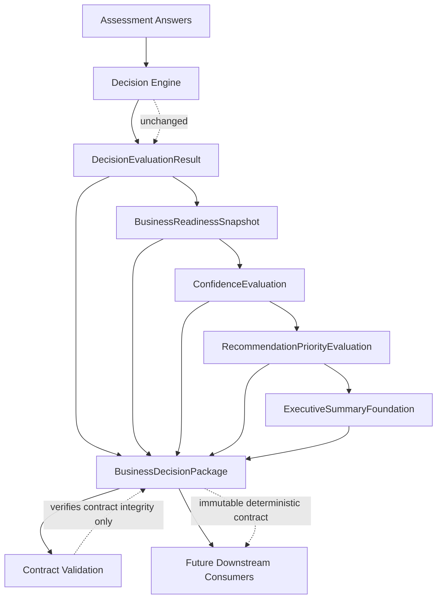

# Sprint 4 Business Decision Package Foundation Complete v1

## Executive Summary

Sprint 4 establishes the Business Decision Package foundation for the Nguyen AI
Assessment Service.

The Assessment Service remains the deterministic Business Decision Engine for
the Nguyen AI Executive Intelligence Platform. Sprint 4 does not change the
Decision Engine, methodology, public/executive assessment boundary, Lambda
handler, API behavior, persistence model, reporting behavior, or recommendation
logic.

The business capability established by Sprint 4 is a governed, immutable,
deterministic output contract that packages existing Sprint 3 foundation
outputs for future downstream consumers. The package gives downstream platform
services one canonical contract to consume while preserving traceability,
versioning, limitations, and validation.

## Sprint Goals

Sprint 4 existed to create the canonical output handoff contract for the
Assessment Service.

Goals:

- Define the Business Decision Package architecture.
- Implement immutable package assembly from existing Sprint 3 outputs.
- Define the deterministic serialization contract.
- Define deterministic identity and versioning semantics.
- Implement deterministic contract validation.
- Preserve Sprint 3 behavior without redesign.
- Keep the Assessment Service boundary limited to deterministic business
  decision outputs.

## Architecture Overview

Sprint 4 extends the Sprint 3 foundation by packaging existing deterministic
outputs into one immutable contract.

```text
Assessment Answers
  ->
Decision Engine
  ->
DecisionEvaluationResult
  ->
BusinessReadinessSnapshot
  ->
ConfidenceEvaluation
  ->
RecommendationPriorityEvaluation
  ->
ExecutiveSummaryFoundation
  ->
BusinessDecisionPackage
  ->
Contract Validation
```



The Business Decision Package is an assembly contract. It packages existing
outputs only. Contract validation verifies integrity only. Neither layer
performs business evaluation or creates new business conclusions.

## Repository Changes

Sprint 4 adds:

- Three architecture documents.
- Two Python modules.
- Two focused unit test files.

No existing Python behavior was changed. No production handler, Lambda routing,
API response, methodology configuration, scoring logic, Decision Engine
aggregation, or Sprint 3 foundation behavior was modified.

## New Architecture Documents

### Business Decision Package Contract

File:

- `docs/architecture/business-decision-package-contract-v1.md`

Purpose:

- Defines the Business Decision Package as the canonical immutable output
  contract of the Assessment Service.
- Establishes package component ownership.
- Defines package immutability, governance, downstream consumer rules, and
  explicit out-of-scope responsibilities.

Architecture role:

- Freezes the package as a deterministic contract that downstream services may
  consume but may not mutate or reinterpret.

### Business Decision Package Serialization Contract

File:

- `docs/architecture/business-decision-package-serialization-contract-v1.md`

Purpose:

- Defines the exact serialized shape of the package.
- Documents root fields, nested fields, ordering rules, version metadata, audit
  metadata, limitation structure, compatibility rules, and serialization
  invariants.

Architecture role:

- Provides the deterministic field-level contract that future consumers and
  contract tests can rely on.

### Business Decision Package Versioning

File:

- `docs/architecture/business-decision-package-versioning-v1.md`

Purpose:

- Defines deterministic package identity and versioning semantics.
- Establishes identity as a governed version tuple:
  `(contractVersion, assessmentVersion, methodologyVersion, componentVersions)`.
- Explicitly excludes UUIDs, runtime IDs, persistence keys, API identifiers,
  HTTP resources, timestamps, sessions, and Lambda-specific concepts.

Architecture role:

- Ensures package identity remains reproducible and independent of runtime
  infrastructure.

## New Python Modules

### Business Decision Package

File:

- `src/assessment/business_decision_package.py`

Purpose:

- Implements immutable package domain models.
- Assembles existing Sprint 3 outputs into one package.
- Adds package audit metadata, limitations, and version metadata.

Inputs:

- `DecisionEvaluationResult`
- `BusinessReadinessSnapshot`
- `ConfidenceEvaluation`
- `RecommendationPriorityEvaluation`
- `ExecutiveSummaryFoundation`

Outputs:

- `BusinessDecisionPackage`
- `BusinessDecisionPackageAudit`
- `BusinessDecisionPackageVersionMetadata`

Architecture role:

- Provides the canonical deterministic output contract object.
- Performs source consistency checks only.
- Does not calculate business conclusions.

### Business Decision Package Validation

File:

- `src/assessment/business_decision_package_validation.py`

Purpose:

- Implements deterministic validation of package contract integrity.
- Returns structured validation results and issues.

Validation coverage:

- Contract completeness.
- Required component presence.
- Version metadata consistency.
- Audit metadata consistency.
- Limitation integrity.
- Serialization contract conformance.
- Versioning invariant conformance.

Architecture role:

- Allows the Assessment Service to verify a package before future downstream
  consumption.
- Enforces approved architecture rules only.
- Does not perform business evaluation or business computation.

## Test Coverage Summary

New test files:

- `tests/test_business_decision_package.py`
- `tests/test_business_decision_package_validation.py`

Coverage added:

- Deterministic package assembly.
- Package immutability.
- Preservation of Sprint 3 output objects.
- No mutation of contained outputs.
- Stable serialization ordering.
- Version metadata integrity.
- Audit object integrity.
- Limitation preservation.
- Contract scope boundaries.
- Valid package validation.
- Missing component rejection.
- Version mismatch detection.
- Serialization contract violation detection.
- Audit violation detection.
- Limitation violation detection.
- Deterministic validation behavior.
- Validation immutability preservation.

Final release validation result:

- Full test suite: 128 passing tests.

## Architectural Decisions

### Package Assembly Is Not Evaluation

The Business Decision Package packages existing deterministic outputs only. It
does not call the Decision Engine, recompute readiness, reinterpret confidence,
assign priority, create recommendations, generate executive summaries, or route
services.

### Serialization Is a Deterministic Contract

The package serialization contract defines root fields, nested fields, and
ordering rules. It is not an API schema, HTTP response shape, persistence
model, OpenAPI document, or JSON Schema.

### Identity Is Version-Based

Package identity is deterministic and version-based. It does not use UUIDs,
timestamps, generated identifiers, database keys, request IDs, sessions, or
Lambda invocation metadata.

### Validation Enforces Contract Integrity

Validation verifies that a package satisfies the approved contract. It returns
structured validation results and does not mutate the package or calculate new
business outputs.

## Governance Decisions

Sprint 4 preserves these governance rules:

- Methodology configuration remains authoritative for business vocabulary.
- The Decision Engine remains authoritative for deterministic readiness
  evaluation.
- Sprint 3 foundation outputs remain downstream consumers.
- The Business Decision Package remains an immutable assembly contract.
- Contract validation enforces approved architectural rules only.
- Public directional assessment and internal executive assessment remain
  separate products and contracts.
- Downstream consumers may read package outputs but may not mutate Assessment
  Service deterministic outputs.
- Breaking package contract changes require updated architecture, serialization
  documentation, versioning documentation, release documentation, migration
  guidance, deterministic tests, and compatibility review.

## What Sprint 4 Explicitly Does NOT Implement

Sprint 4 does not implement:

- API routes.
- Lambda handler changes.
- API Gateway integration.
- Persistence.
- Database records.
- Runtime package identifiers.
- Generated identifiers.
- Timestamps.
- Evidence ingestion.
- Evidence repositories.
- Recommendation generation.
- Final recommendation priority assignment.
- Service routing.
- Service tier selection.
- Executive narratives.
- Executive reports.
- Dashboard behavior.
- Portfolio Intelligence.
- Public directional assessment integration.
- Public-to-executive assessment translation.
- AI reasoning.
- LLM reasoning.
- Bedrock decision making.

## Remaining Future Work

Future work remains intentionally unimplemented until approved in later
sprints:

- Exposing package outputs through a governed API contract.
- Defining any persistence architecture for immutable package storage.
- Defining downstream evidence intelligence integration.
- Defining executive reporting architecture.
- Defining final confidence formulas and confidence-level assignment.
- Defining final recommendation priority assignment.
- Defining recommendation generation, if approved.
- Defining service decisions or service tier selection, if approved.
- Defining consumer compatibility procedures before external package
  consumption.

## Relationship to Sprint 3

Sprint 3 created the deterministic foundation outputs:

- `BusinessReadinessSnapshot`
- `ConfidenceEvaluation`
- `RecommendationPriorityEvaluation`
- `ExecutiveSummaryFoundation`

Sprint 4 packages those outputs without changing them.

Sprint 3 established traceable executive-intelligence foundation artifacts.
Sprint 4 establishes the governed package contract that can carry those
artifacts forward to future downstream consumers.

The Sprint 3 architecture remains frozen and unchanged.

## Relationship to Future Executive Intelligence Platform

The Business Decision Package is the deterministic handoff from the Assessment
Service to the broader Nguyen AI Executive Intelligence Platform.

Future downstream capabilities may consume the package:

- Evidence Intelligence may link outputs to supporting evidence.
- Executive Reporting may translate package contents into approved executive
  communication artifacts.
- Portfolio Intelligence may aggregate package outputs across clients or time.
- Dashboards may display package outputs and downstream enrichment.

These future services must consume the package rather than recomputing or
replacing Assessment Service deterministic outputs.

## Release Completion Criteria

Sprint 4 is complete when:

- Business Decision Package architecture is documented.
- Business Decision Package implementation exists.
- Serialization contract is documented.
- Versioning and identity semantics are documented.
- Contract validation exists.
- Unit tests cover package assembly and validation behavior.
- Full test suite passes.
- Deterministic guarantees are preserved.
- Governance guarantees are preserved.
- No API, persistence, reporting, recommendation, or service-routing behavior
  is introduced.

Release validation summary:

- New Python modules: 2.
- New architecture documents: 3.
- Total tests: 128 passing tests.
- Deterministic guarantees: preserved.
- Governance guarantees: preserved.
- Decision Engine behavior: unchanged.
- Methodology behavior: unchanged.
- Sprint 3 foundation behavior: unchanged.

## Recommended Next Sprint

Recommended next sprint:

- Sprint 5: Business Decision Package Exposure Planning.

Sprint 5 should begin with architecture planning only. It should determine
whether, when, and how the package may be exposed to downstream consumers while
preserving the Assessment Service boundary.

Potential planning topics:

- API contract options.
- Persistence architecture options.
- Downstream consumer compatibility policy.
- Release and migration strategy.
- Evidence Intelligence integration boundary.

Sprint 5 should not begin by implementing APIs or persistence without an
approved architecture baseline.
